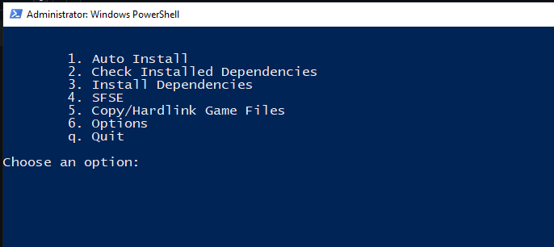

# How-to guide:

I understand that for someone without any dev experience this might seems a bit daunting, but I've made it as simple as possible. Once you follow this guide you will see just how simple it is to build SFSE that works on Gamepass/Windows version of Starfield.

:warning: Bare in mind that not all SFSE mods will work, many require a patch as they don't use SFSE directly but as an injector. I've patched many and have them available to download on github, you can see the list [here](#supported-mods). If the source is available and it's open source I can patch it. I'm hoping that in the future with the introduction of the address library I won't need to patch these mods and they'll work out of the box.


# Table of Contents

- [Auto Installer GUI](#auto-installer-gui)
- [Manual Process](#manual-process)
- [Prerequisites](#prerequisites)
- [Backing up save files](#backing-up-save-files)
- [Removing Permissions](#removing-permissions)
- [Running the script](#running-the-script)
    - [Pulling SFSE](#pulling-sfse)
    - [Pulling the Script](#pulling-the-script)
    - [Patching](#patching)
    - [Updating Addresses](#update-addresses)
    - [Building](#Building)
- [Did it work?](#did-it-work)
- [Supported Mods](#supported-mods)

## Auto Installer GUI
If you're not as technical or just can't be bothered following the instructions below, you can use the Auto Installer `installer.ps1` to do the following:

    Check Dependencies
    Install Missing Dependencies
    Pull SFSE repo
    Patch Repo
    Build Repo
    Move Files to game folder
    Hardlink/Copy game files to remove permissions


<details>
  <summary>Script Preview:</summary>

  

  
</details>
<br />

If you have not ran Powershell scripts before you will need to change the Execution Policy to Unrestricted in order to launch the script `cli.ps1` or `run.bat`, you can do so by doing the following:

1. Search for Powershell (Win Key)
2. Select "Run as Administrator"
3. Run the following command

```
    Set-ExecutionPolicy Unrestricted    
```

4. Select 'Yes'
5. Run `run.bat`

<details>
  <summary>Screenshot:</summary>

  

  
</details>
<br />

You can re-enable the restriction by running the command:

```
    Set-ExecutionPolicy Restricted    
```

# Manual Process
For those who like to get their hands dirty, follow the guide below.

## Prerequisites
Going on the assumption that you have a clean windows install with absolutely no tools installed, this is what you will need to complete this guide.

- Powershell 5 | Powershell 7 *
- [Python 3.11](https://www.python.org/ftp/python/3.11.0/python-3.11.0-amd64.exe)
- [Git](https://github.com/git-for-windows/git/releases/download/v2.42.0.windows.2/Git-2.42.0.2-64-bit.exe)
- [CMake](https://github.com/Kitware/CMake/releases/download/v3.27.6/cmake-3.27.6-windows-x86_64.msi)
- [Windows Visual Studio Community](https://visualstudio.microsoft.com/downloads/)
    - Select `Desktop development with C++` on installation, no need for the others
    - Ensure you have at least `VS 2019 C++ Build Tools` (`MSVC v142`)

<i>Be sure to add these to windows path if the option is available</i>

\* *Powershell 5 comes pre-installed with windows, I'd recommend this version as it's been developed/tested with it.*

## Backing up save files

:warning: I highly recommend you backup your save files!

- Windows Key + R:
- Type into the input box
```
    %localappdata%/packages/BethesdaSoftworks.ProjectGold_3275kfvn8vcwc/SystemAppData/wgs
```
- Backup the folder with the random numbers

<details>
  <summary>Screenshot:</summary>

  

  
</details>
<br />

#### Note: The `BethesdaSoftworks` folder may change names, if so you may need to go to it manually, everthing else won't change.

## Removing Permissions

Windows store games have special permissions that prevents any tampering with the games exe (and in some cases the files), we will need to remove this in order to inject the mods with SFSE. Running the compiled SFSE exe in the game folder won't work.

You have two options:

1. [Copy Files](#copy-files)
2. [Hardlink](#hardlink)

:warning: The Hardlink script won't work across separate drives

#### Copy Files

If you have the space to do so, I would highly recommend just copying the files to another folder, this prevents the mods breaking when the game updates. I can still play `v1.7.29` as of right now, if it changes in the future I'll add a note.

1. Select all files/folders within `content` folder (or `CTRL + A`)
2. Right-Click `Copy`
3. Right-click `Paste` into target folder

:bulb: Be sure to copy the files to a directory where you have full permissions eg. Desktop

#### Hardlink

Hardlinking will save some space, at least with my script, it will create a new version of the files in the root of the game folder but will create a junction of the data folders. I haven't used this method but it may break when the game updates as the folders will be modified via the original game folder.

Script:
```powershell
Get-ChildItem | ForEach-Object { 
    $path  = "path/to/new/folder"

    # We can't hardlink folders, use junction
    if ($_.PSIsContainer) {
        New-Item -ItemType Junction -Path "$($path)\$($_.Name)" -Value $_.FullName 
    }
    else { 
        if ($_.Name -ne "Starfield.exe") {
            New-Item -ItemType HardLink -Path "$($path)\$($_.Name)" -Value $_.FullName 
        }
    }
}

pause #Not really needed unless you want to check for errors
```

1. Create file `hardlink-files.ps1` :grey_exclamation: <sup>name doesn't matter</sup>
2. Move file to the `content` folder
2. Edit and paste the above script into it
2. Right-Click > `Run with Powershell`

The files will be added to the new folder you specified.

<details>
  <summary>Screenshots:</summary>

  

  

  

</details>
<br />

#### Can't move exe?

You'll probably get an error when trying to move `Starfield.exe` manually, if this happens, do the following:

1. Right-Click > Cut
2. Paste `Starfield.exe` to the target folder (Right-click in folder > paste or `CTRL + V`)
3. Copy it back to the original game folder

<details>
  <summary>Screenshots:</summary>

  

  

  

</details>
<br />

You will notice that the icon of the exe will change to the starfield logo, this is good.

<details>
  <summary>Icon:</summary>

  

</details>

### Pulling SFSE

Now we get to the bones of the guide.

In most cases the script will lag behind the latest commit of SFSE (Not necessarily the version available), so when we pull the repo we need to checkout the correct commit or the script may not work as intended.

- Open Command Prompt *
- `CD` to the folder where you want to download the source

```
    cd /folder/you/will/like/to/keep/the/repo
```
- Clone the repo
```
    git clone https://github.com/ianpatt/sfse.git
```
- `CD` into the folder created
```
    cd sfse
```
- Now we checkout the commit **
```
    git checkout <commit-id>
```

*You can do this in powershell too but I'll be using CMD

**You can find the commit id on the hex_table file eg. git <i>hex_table_1.7.33_`9f55120a`.json</i>

<details>
  <summary>Screenshots:</summary>

  

  

</details>

### Pulling the Script

It's almost identical the above without the checkout part.

- Open Command Prompt
- `CD` to the folder where you want to download the source

```
    cd /folder/you/will/like/to/keep/the/repo
```
- Clone the repo
```
    https://github.com/gazzamc/starfield_hex_updater.git
```
- `CD` into the folder created
```
    cd starfield_hex_updater
```

<details>
  <summary>Screenshot:</summary>

  

</details>

### Patching

Patching the exe is incredibly simple :)

- Open Command Prompt
- `CD` to the `starfield_hex_updater` folder
```
    cd starfield_hex_updater
```
- Type the following *
```

    python hex_updater.py -m patch -p /path/to/SFSE

```

*Optionally you can prevent the backup of files touches with `-b false`

**Be sure the path is pointing to the folder specified in `-p`, the script expects this folder

<details>
  <summary>Screenshot:</summary>

  

</details>

### Updating Addresses

Very similar to the last step

- Open Command Prompt
- `CD` to the `starfield_hex_updater` folder
```
    cd starfield_hex_updater
```
- Type the following *
```

    python hex_updater.py -m update -p </path/to/SFSE>/sfse -d /path/to/hex_tables/<latest-hex-table-json>

```

*Optionally you can prevent the backup of files touches with `-b false`

**Be sure the path is pointing to the folder specified in `-p`, the script expects this folder

Note: The path should point to the sfse folder within the sfse root folder eg. `sfse/sfse`

<details>
  <summary>Screenshots:</summary>

  
  

</details>

### Building

The final step, with everything patched we can follow the instructions on SFSE repo and build the EXE/DLL

- Open Command Prompt
- `CD` to the folder you cloned the sfse repo
- Run the command
```

    cmake -B sfse/build -S sfse

```
- Run the second command
```

    cmake --build sfse/build --config Release

```

You will find the exe and dll within a Release folder under their respective names inside the build folder. eg. `Build/sfse_loader/Release`

As with the official version move both files to the root of the game folder we created above. Start sfse_loader.exe to run the game.

```
    
    build\sfse\Release
    build\sfse_loader\Release

```

<details>
  <summary>Screenshots:</summary>

  

  

  

  

</details>
<br />

# Did it work?

Once you boot up the game, go to settings and look for the sfse version number (beside the game version). Alternatively you can go the `My Games\Starfield\SFSE\Logs` and check `sfse.txt` to see if it loaded correctly.

Enjoy the game :)


# Issues / Fixes

- `Couldn't find _get_narrow_winmain_command_line`
- `Couldn't find Starfield.exe`

When checking the logs, if you see the following at the top of the `sfse.txt` this means the permissions were not removed from the exe and it didn't inject correctly. Did you try running it from the original folder?

Re-do the [Removing Permissions](#removing-permissions) step.

- `The Windows Store (gamepass) version of Starfield is not supported.`

Did you do the [Patching](#patching) step, and point it to the sfse folder (not the root of repo)?

- `The game doesn't launch/crashes`

Be sure you're checking out the correct commit id and using the correct version of the game, this information is within the name of the hex_table file. 

Also if the game is launching and it's crashing, please be sure you're using one of the [Supported Mods](#supported-mods), not all mods for sfse will work with this modified version. If the mod has an open source repo (usually mentioned on nexus mods) you can reach out to me and I'll try and patch it.

- `The AIO script hangs when Building SFSE`

This is a known issues and I'm currently looking into a solution to prevent or mitigate it in the future. In most cases the Build has completed and the main script hasn't been given back focus, occasionly clicking on the main window makes it continue. If that fails force close the script `CTRL + C` and re-run it.

### Supported Mods

Compatible mods can be found [Here](https://github.com/gazzamc/starfield_hex_updater/blob/main/docs/compatibility/README.md).

If the mod has implemented the Address Library ([Nexus Mods](https://www.nexusmods.com/starfield/mods/3256?tab=files)) there's a good chance it will work. I haven't extensively tested mods since the change, so If you find a mod that's not working, reach out to me and I'll add it below.
